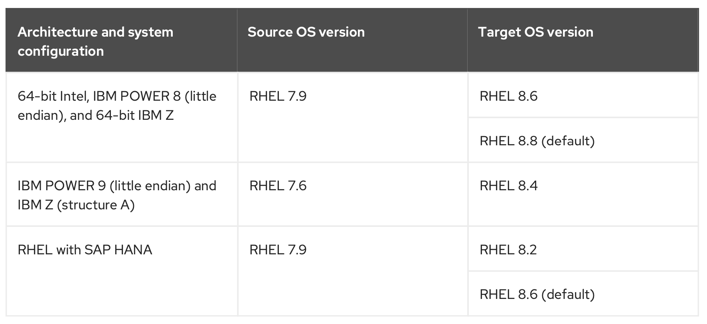

# Red Hat Enterprise Linux 8 Upgrading from RHEL 7.9 to RHEL 8.6


## Planning stage:

### Supported path: 




```cat /etc/redhat-release```

```uname -a```

```cat /proc/cpuinfo```

```getenforce```

```yum versionlock list```

```yum versionlock clear```

```lsblk```

```df -hT```

```cat /proc/mounts```

```cat /etc/fstab```

```ip a```

```systemctl --type=service --state=running```

```yum repolist```

```yum list installed```


```yum-config-manager --enable rhui-client-config-server-7```

```yum-config-manager --enable rhel-7-server-rhui-extras-rpms```

```yum -y install rh-amazon-rhui-client leapp-rhui-aws```


```yum update```

```reboot```

```yum install leapp-upgrade```


```wget https://access.redhat.com/articles/3664871```

```tar -xzf leapp-data-22.tar.gz -C /etc/leapp/files && rm leapp-data-22.tar.gz```


```leapp preupgrade --target 8.6 --no-rhsm```


Ref: 
1. (https://access.redhat.com/documentation/en-us/red_hat_enterprise_linux/8/html-single/upgrading_from_rhel_7_to_rhel_8/index)

